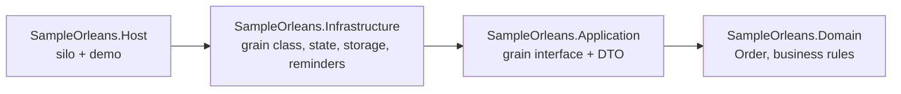
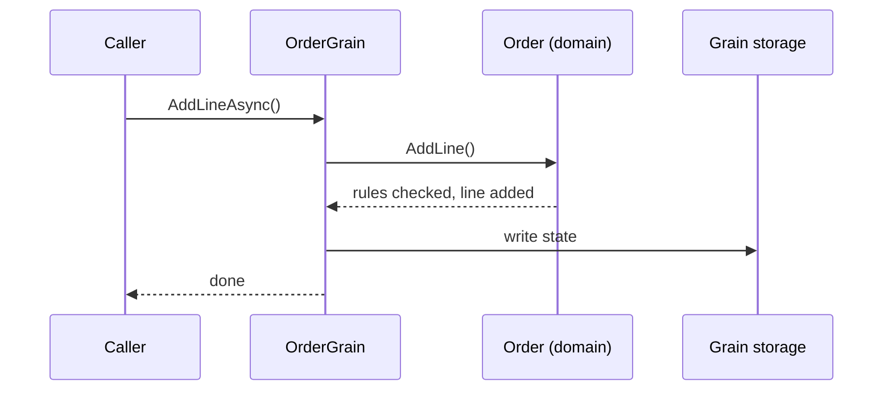

# Orleans with Clean Architecture

[](https://github.com/rezabazvand/dotnet-orleans-clean-architecture/actions/workflows/build.yml)

A small .NET 10 sample that puts [Microsoft Orleans](https://learn.microsoft.com/dotnet/orleans/) behind Clean Architecture boundaries.

It answers two questions:

1. How do grains remove race conditions without locks, row versions or retry loops?
2. Where does Orleans go in a layered solution, so that the domain model does not know it exists?

There is one entity, an **order**. It gets lines added and is then confirmed. A draft order that nobody confirms in time cancels itself.

## Run it

You need the .NET 10 SDK. Nothing else: storage and reminders are in-memory.

```bash
dotnet run --project src/SampleOrleans.Host
```

The demo takes about 15 seconds, most of it waiting for a reminder to fire. It prints four scenarios:

| # | Scenario | What it shows |
|---|----------|---------------|
| 1 | A plain `Order` object hit from many threads | Lost updates or a corrupted list. Different on every run. |
| 2 | The same `Order` behind a grain, 1,000 concurrent calls | Exactly 1,000 lines. No lock in the code. |
| 3 | `Confirm` racing with 200 `AddLine` calls on one order | Lines that arrive after the confirm are rejected. None slips in. |
| 4 | Two draft orders, one confirmed and one forgotten | The forgotten one is cancelled by a reminder. |

Scenarios 2 to 4 are checked, and the process exits with a non-zero code if any of them fails. The CI workflow runs the demo on every push.

## The idea

A grain is an object with an identity (`Order 42`) that Orleans keeps in memory and addresses by key. Calls to one grain are executed **one at a time**. Calls to different grains run in parallel.

That single rule is why `OrderGrain` can do a read-modify-write on its order with no protection around it:

```csharp
public async Task AddLineAsync(string sku, int quantity, decimal unitPrice)
{
    _order.AddLine(sku, quantity, unitPrice);

    await SaveAsync();
}
```

Two requests for the same order never interleave here. Two requests for different orders do not wait for each other.

## Layers



| Project | Contains | Knows about Orleans? |
|---------|----------|----------------------|
| `SampleOrleans.Domain` | `Order`, `OrderLine`, the rules, `DomainException` | No. Zero package references. |
| `SampleOrleans.Application` | `IOrderGrain`, `OrderSummary` | Only the abstractions (interface and serializer attributes). |
| `SampleOrleans.Infrastructure` | `OrderGrain`, `OrderState`, provider setup | Yes. |
| `SampleOrleans.Host` | Silo configuration and the demo | Yes. |

How one call flows:



## Design decisions

**The grain is a thin shell around the aggregate.** `OrderGrain` holds the order in memory, calls a domain method, saves, and maps to a DTO. Every business rule is in `Order` and can be unit tested with `new Order(...)`, no silo required.

**Persisted state is not the domain model.** `OrderState` lives in Infrastructure and carries the `[GenerateSerializer]` attributes. The aggregate stays free of serialization concerns, and its shape can change without breaking stored data.

**The grain interface lives in Application.** It is the list of use cases, and callers depend on it, not on the grain class. The price is that Application references the Orleans abstractions package. I think that is the honest trade-off: hiding `IGrainWithGuidKey` behind a second set of interfaces adds a layer of mapping and buys very little.

**Operations are idempotent.** Confirming a confirmed order does nothing, and creating an existing order does nothing. A caller that times out can simply retry.

**A deadline is a reminder, not a background job.** Each order registers its own `confirmation-timeout` reminder. Reminders are stored outside the grain, so they survive deactivation and restarts; a grain timer would not. The reminder tick goes through the same one-at-a-time queue as any other call, so it cannot race with `ConfirmAsync`. Orleans does not allow a reminder period below one minute, so the first tick comes after the timeout and a successful tick removes the reminder.

**A failed write drops the activation.** If saving fails, memory and storage no longer agree, so the grain deactivates and the next call starts from what is actually stored.

## Taking it further

This sample keeps everything in memory so that it runs with one command. For real use:

- Replace `AddMemoryGrainStorage` and `UseInMemoryReminderService` in `SampleOrleans.Infrastructure/DependencyInjection.cs` with a durable provider (ADO.NET, Redis, Azure Storage, ...). Nothing else changes.
- Replace `UseLocalhostClustering` with a real clustering provider and run more than one silo.
- Remember that a grain protects its **own** state. Work that spans several grains still needs idempotency or Orleans transactions.
- A slow grain call blocks every other call to that grain. Keep calls short.

## Related

[dotnet-domain-events-outbox](https://github.com/rezabazvand/dotnet-domain-events-outbox): domain events, integration events and the transactional outbox with EF Core.

## License

MIT
